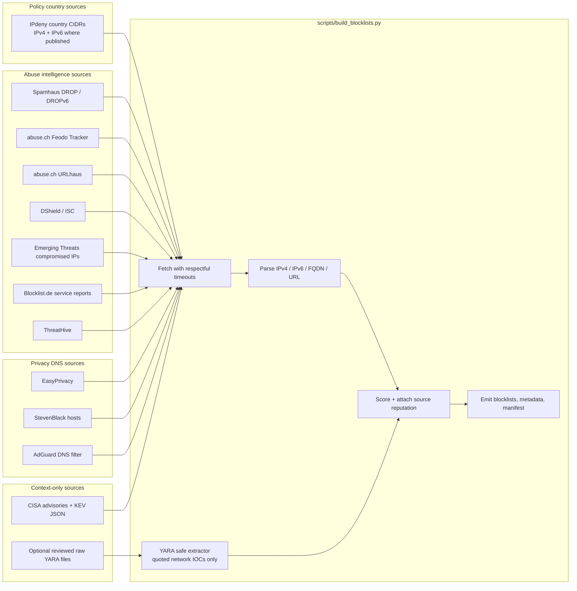
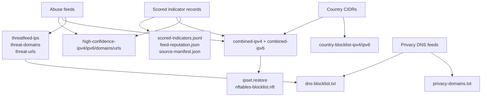
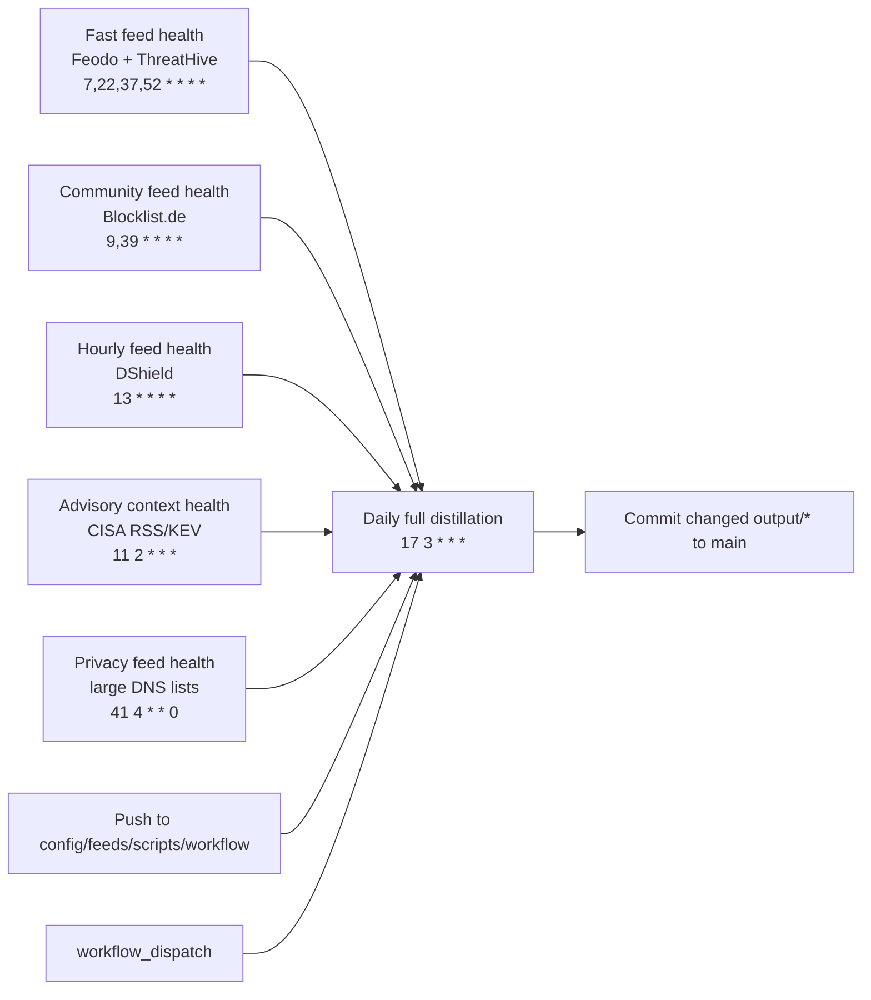

# AbuseBlacklist

Daily, GitHub-hosted blacklist distillation for country CIDR blocking, open abuse
feeds, malware URL/domain feeds, privacy DNS feeds, and advisory context.

The repo is designed to publish pullable raw files for firewalls, Skynet,
ipset, nftables, DNS blocklists, and audit tooling. It distinguishes three
classes of data:

- **Abuse intelligence**: malicious IPs, domains, and URLs from threat feeds.
- **Policy country blocks**: IPdeny country CIDRs for selected countries.
- **Privacy DNS filtering**: tracker/adware domains, kept separate from abuse proof.

It does **not** generate law-enforcement, honeypot, or surveillance-evasion
target lists. Privacy filtering is limited to public tracker/adware DNS lists
and documented policy domains.

## Primary Pull URLs

Skynet broad IPv4 feed:

```text
https://raw.githubusercontent.com/Ununp3ntium115/AbuseBlacklist/main/output/combined-ipv4.txt
```

Skynet high-confidence abuse-only IPv4 feed:

```text
https://raw.githubusercontent.com/Ununp3ntium115/AbuseBlacklist/main/output/high-confidence-ipv4.txt
```

Release-page (latest release asset) URLs:

```text
https://github.com/Ununp3ntium115/AbuseBlacklist/releases/latest/download/combined-ipv4.txt
https://github.com/Ununp3ntium115/AbuseBlacklist/releases/latest/download/high-confidence-ipv4.txt
https://github.com/Ununp3ntium115/AbuseBlacklist/releases/latest/download/combined-ipv6.txt
https://github.com/Ununp3ntium115/AbuseBlacklist/releases/latest/download/dns-blocklist.txt
```

Router command example:

```bash
/jffs/scripts/firewall import blacklist https://raw.githubusercontent.com/Ununp3ntium115/AbuseBlacklist/main/output/high-confidence-ipv4.txt
```

Use `combined-ipv4.txt` if you want country policy blocks plus abuse feeds.
Use `high-confidence-ipv4.txt` if you want abuse-feed evidence without country
policy ranges.

## Generated Artifacts

```text
output/source-manifest.json
output/feed-reputation.json
output/scored-indicators.json
output/scored-indicators.jsonl
output/advisory-context.json
output/country-blocklist-ipv4.txt
output/country-blocklist-ipv6.txt
output/threatfeed-ips.txt
output/threat-domains.txt
output/threat-urls.txt
output/privacy-domains.txt
output/dns-blocklist.txt
output/high-confidence-ipv4.txt
output/high-confidence-ipv6.txt
output/high-confidence-domains.txt
output/high-confidence-urls.txt
output/combined-ipv4.txt
output/combined-ipv6.txt
output/ipset.restore
output/nftables-blocklist.nft
```

Raw URLs:

```text
https://raw.githubusercontent.com/Ununp3ntium115/AbuseBlacklist/main/output/source-manifest.json
https://raw.githubusercontent.com/Ununp3ntium115/AbuseBlacklist/main/output/feed-reputation.json
https://raw.githubusercontent.com/Ununp3ntium115/AbuseBlacklist/main/output/scored-indicators.jsonl
https://raw.githubusercontent.com/Ununp3ntium115/AbuseBlacklist/main/output/advisory-context.json
https://raw.githubusercontent.com/Ununp3ntium115/AbuseBlacklist/main/output/combined-ipv4.txt
https://raw.githubusercontent.com/Ununp3ntium115/AbuseBlacklist/main/output/combined-ipv6.txt
https://raw.githubusercontent.com/Ununp3ntium115/AbuseBlacklist/main/output/high-confidence-ipv4.txt
https://raw.githubusercontent.com/Ununp3ntium115/AbuseBlacklist/main/output/high-confidence-ipv6.txt
https://raw.githubusercontent.com/Ununp3ntium115/AbuseBlacklist/main/output/threat-domains.txt
https://raw.githubusercontent.com/Ununp3ntium115/AbuseBlacklist/main/output/threat-urls.txt
https://raw.githubusercontent.com/Ununp3ntium115/AbuseBlacklist/main/output/privacy-domains.txt
https://raw.githubusercontent.com/Ununp3ntium115/AbuseBlacklist/main/output/dns-blocklist.txt
https://raw.githubusercontent.com/Ununp3ntium115/AbuseBlacklist/main/output/ipset.restore
https://raw.githubusercontent.com/Ununp3ntium115/AbuseBlacklist/main/output/nftables-blocklist.nft
```

## Architecture Graph



## Output Graph



## Scheduled Workflow Graph



The high-frequency workflows only make lightweight `HEAD` probes. The full
payload ingestion runs once daily, or manually, so upstream sources are not
hammered.

## Release Page Automation

Releases are now published automatically from generated outputs by
`.github/workflows/publish-release.yml`.

- Connector trigger: runs after successful `Daily threatfeed dump` workflow
  completion (`workflow_run`).
- Fallback schedule: `45 3 * * *` UTC in case the connector trigger is missed.
- Manual trigger: `workflow_dispatch` is available.

Each successful run creates a new immutable release tag:

```text
rulesets-YYYY-MM-DDTHHMMSSZ
```

GitHub's `/releases/latest/download/...` URLs point to the newest complete
snapshot, while older Releases remain available as the historical database.

Release notes include rule counts for:

- IPv4 combined rules
- IPv6 combined rules
- Country IPv4/IPv6 policy rules
- Threat IP rules
- Threat DNS rules
- Threat URL rules
- Privacy DNS rules
- DNS blocklist rules
- High-confidence IPv4/IPv6/domain/URL rules

Release assets include every generated file under `output/`: combined feeds,
country policy feeds, threat IP/domain/URL feeds, privacy DNS, high-confidence
abuse outputs, source manifest, feed reputation metadata, scored indicator JSON,
advisory context, and firewall export files.

## Scoring And Justification

Each indicator is scored from source reputation, source confidence, and
corroboration. Detailed source reasoning lives in `output/feed-reputation.json`;
per-indicator compact metadata lives in `output/scored-indicators.jsonl`.

Example JSONL record:

```json
{"indicator":"203.0.113.10/32","type":"ipv4","confidence_score":90,"reputation_score":0.9,"source_count":1,"sources":["abuse.ch Feodo Tracker"],"ttl_hours":24,"enforcement":"abuse"}
```

Default source model:

| Source | Use | Score | Reason |
| --- | --- | ---: | --- |
| Spamhaus DROP / DROPv6 | Abuse IP ranges | 95 | Advisory drop-all-traffic networks. |
| abuse.ch Feodo Tracker | Botnet C2 IPs | 90 | Active or recent botnet C2 infrastructure. |
| abuse.ch URLhaus | Malware URLs/domains | 88 | Malware distribution URLs and hosts. |
| ThreatHive | Malicious IPs | 78 | OSINT and honeypot telemetry. |
| DShield | Attack telemetry IPs | 75 | Internet Storm Center/DShield observations. |
| Emerging Threats | Compromised IPs | 72 | Compromised infrastructure feed. |
| Blocklist.de | Reported attacker IPs | 60 | Useful but noisier community telemetry. |
| IPdeny | Country policy CIDRs | 55 | Geo-policy block, not abuse evidence. |
| Privacy DNS feeds | Tracker/adware DNS | 68-70 | Privacy filtering, not abuse proof. |

High-confidence outputs require `confidence_score >= 75` and `enforcement ==
"abuse"`. Country policy CIDRs and privacy DNS entries are intentionally excluded
from high-confidence abuse files.

## Advisory Context

`feeds/advisory-context-feeds.txt` currently tracks:

- CISA Cybersecurity Advisories RSS
- CISA Alerts RSS
- CISA Cybersecurity Advisories RSS subset
- CISA Known Exploited Vulnerabilities JSON

These sources generate `output/advisory-context.json`. They are context only:
news, advisories, and KEV entries do not create blocks by themselves. They are
there to explain active campaigns and help review whether feed hits line up with
current public reporting.

## Emergency Manual IOCs

For urgent campaign response, add validated IPs to:

- `feeds/manual-threat-ips.txt`

This file is ingested by `feeds/threat-ip-feeds.txt` and is treated as an abuse
source during each build.

Recommended workflow:

1. Add only concrete attacker infrastructure (single IPs/CIDRs), not broad
  hosting ranges.
2. Add the related write-up or advisory URL to
  `feeds/advisory-context-feeds.txt` for analyst context.
3. Rebuild with `python3 scripts/build_blocklists.py`.
4. Verify presence in `output/threatfeed-ips.txt` and `output/combined-ipv4.txt`.

## YARA IOC Extraction Policy

`feeds/yara-ioc-feeds.txt` accepts direct raw `.yar` or `.yara` URLs, but it is
empty by default. When populated, the builder extracts only:

- quoted IPv4 or IPv6 literals
- quoted fully-qualified domains
- quoted HTTP(S) URLs

It rejects generic strings, regex patterns, wildcard domains, mutexes, file
paths, hashes, and broad text fragments. YARA-derived network IOCs still need
source scoring and should be reviewed before being used for blocking.

## Privacy DNS Boundary

`privacy-domains.txt` and `dns-blocklist.txt` use public privacy/adware/tracker
lists. This is for privacy filtering, not for evading monitoring, law
enforcement systems, honeypots, or safety tooling. Requests for enumerated
surveillance or honeypot infrastructure should be handled as a policy review
problem, not as an automated target list.

## Run Manually

```bash
python3 scripts/build_blocklists.py
```

With a shorter per-source timeout:

```bash
python3 scripts/build_blocklists.py --timeout 45
```

## Firewall Examples

ipset:

```bash
python3 scripts/build_blocklists.py
sudo ipset restore < output/ipset.restore
```

nftables:

```bash
python3 scripts/build_blocklists.py
sudo nft -f output/nftables-blocklist.nft
```

## Server Cron

The repo also includes `cron/abuseblacklist.crontab` for non-GitHub servers:

```cron
17 3 * * * cd /opt/AbuseBlacklist && /usr/bin/env bash scripts/run_daily_update.sh >> /var/log/abuseblacklist-daily.log 2>&1
```

Install example:

```bash
git clone https://github.com/Ununp3ntium115/AbuseBlacklist.git /opt/AbuseBlacklist
cd /opt/AbuseBlacklist
chmod +x scripts/run_daily_update.sh
crontab cron/abuseblacklist.crontab
```

## Country Policy List

- Russia
- China
- North Korea
- Iran
- Israel
- Cuba
- Syria
- Belarus
- Myanmar/Burma
- Afghanistan
- Iraq
- Lebanon
- Libya
- Venezuela
- Sudan
- South Sudan
- Somalia
- Yemen
- Zimbabwe
- Democratic Republic of the Congo

North Korea is included for IPv4. IPdeny does not currently publish an IPv6
aggregate for `kp`, so the builder skips that known-missing IPv6 URL.

## Notes

- This is intentionally broad and can block legitimate users, VPNs, cloud
  providers, CDNs, partners, and researchers.
- Geo-blocking is not a complete sanctions/export-control solution.
- Review each upstream source's license, terms, and rate limits before production
  use.
- Prefer `high-confidence-*` outputs when false positives matter more than raw
  coverage.
- Prefer `combined-*` outputs when the goal is broad country-policy plus abuse
  blocking.
