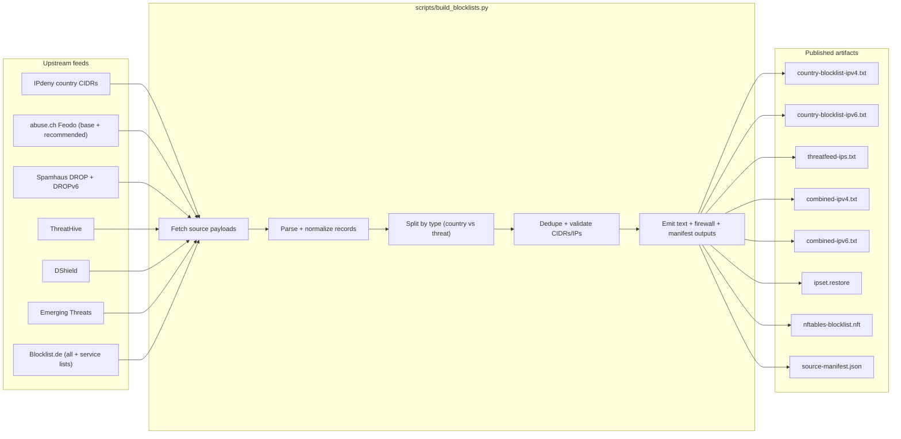
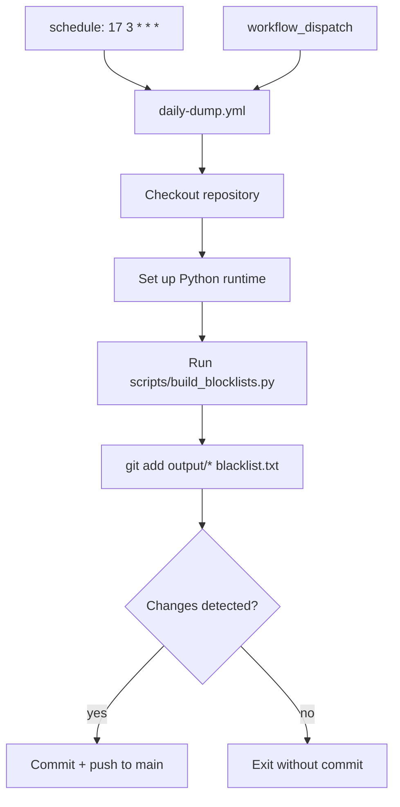
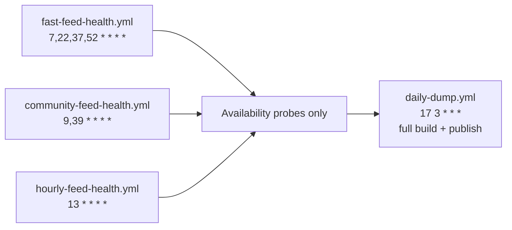
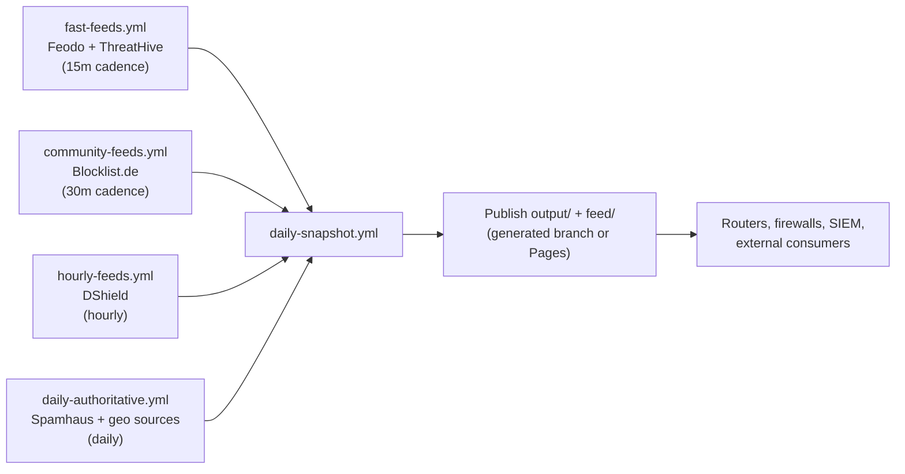
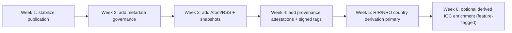

# AbuseBlacklist

Daily threatfeed dump for country CIDR blocking and open threat-intel IP feeds.

This repo performs a daily GitHub Actions dump of:

- Country CIDR ranges from IPdeny for requested and high-risk/export-watchlist countries.
- Open threat IP feeds from ThreatHive, abuse.ch Feodo Tracker, Spamhaus DROP/DROPv6, DShield, Emerging Threats, and Blocklist.de.
- Open threat DNS/URL feeds from abuse.ch URLhaus for domain and URL distillation.

## Distillation deliverables (evidence gate)

This repository now publishes distilled indicators across all requested network types:

- IPv4 CIDR/IP outputs
- IPv6 CIDR/IP outputs
- DNS/domain outputs
- URL outputs

Primary output files:

```text
output/combined-ipv4.txt
output/combined-ipv6.txt
output/threatfeed-ips.txt
output/threat-domains.txt
output/threat-urls.txt
output/source-manifest.json
```

## Architecture graph (current implementation)



## Workflow graph (current GitHub Actions jobs)





## Target staged workflow (recommended next step)



## Rollout timeline graph (recommended)



## Daily Action

The workflow runs daily at **03:17 UTC**:

```yaml
on:
  schedule:
    - cron: "17 3 * * *"
  workflow_dispatch: {}
```

It rebuilds and commits:

```text
output/source-manifest.json
output/country-blocklist-ipv4.txt
output/country-blocklist-ipv6.txt
output/threatfeed-ips.txt
output/threat-domains.txt
output/threat-urls.txt
output/combined-ipv4.txt
output/combined-ipv6.txt
output/ipset.restore
output/nftables-blocklist.nft
```

## Raw pull URLs

```text
https://raw.githubusercontent.com/Ununp3ntium115/AbuseBlacklist/main/output/combined-ipv4.txt
https://raw.githubusercontent.com/Ununp3ntium115/AbuseBlacklist/main/output/combined-ipv6.txt
https://raw.githubusercontent.com/Ununp3ntium115/AbuseBlacklist/main/output/country-blocklist-ipv4.txt
https://raw.githubusercontent.com/Ununp3ntium115/AbuseBlacklist/main/output/country-blocklist-ipv6.txt
https://raw.githubusercontent.com/Ununp3ntium115/AbuseBlacklist/main/output/threatfeed-ips.txt
https://raw.githubusercontent.com/Ununp3ntium115/AbuseBlacklist/main/output/threat-domains.txt
https://raw.githubusercontent.com/Ununp3ntium115/AbuseBlacklist/main/output/threat-urls.txt
https://raw.githubusercontent.com/Ununp3ntium115/AbuseBlacklist/main/output/ipset.restore
https://raw.githubusercontent.com/Ununp3ntium115/AbuseBlacklist/main/output/nftables-blocklist.nft
https://raw.githubusercontent.com/Ununp3ntium115/AbuseBlacklist/main/output/source-manifest.json
```

## Run manually

Use GitHub Actions > Daily threatfeed dump > Run workflow.

Or run locally:

```bash
python3 scripts/build_blocklists.py
```

## Firewall examples

ipset:

```bash
python3 scripts/build_blocklists.py
sudo ipset restore < output/ipset.restore
```

nftables:

```bash
python3 scripts/build_blocklists.py
sudo nft -f output/nftables-blocklist.nft
```

## Current country dump list

- Russia
- China
- North Korea
- Iran
- Israel
- Cuba
- Syria
- Belarus
- Myanmar/Burma
- Afghanistan
- Iraq
- Lebanon
- Libya
- Venezuela
- Sudan
- South Sudan
- Somalia
- Yemen
- Zimbabwe
- Democratic Republic of the Congo

## Notes

- This is intentionally broad and may block legitimate users, VPNs, cloud providers, CDNs, and partners.
- Review each upstream source's license, terms, and rate limits.
- Geo-blocking is not a complete sanctions/export-control solution.
- DNS/URL outputs are intended for abuse and malware blocking contexts; do not use them to target safety tooling, researchers, or lawful monitoring systems.
